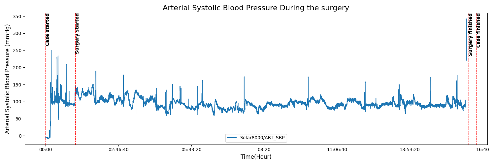
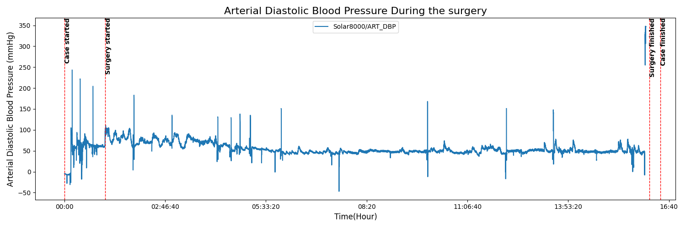
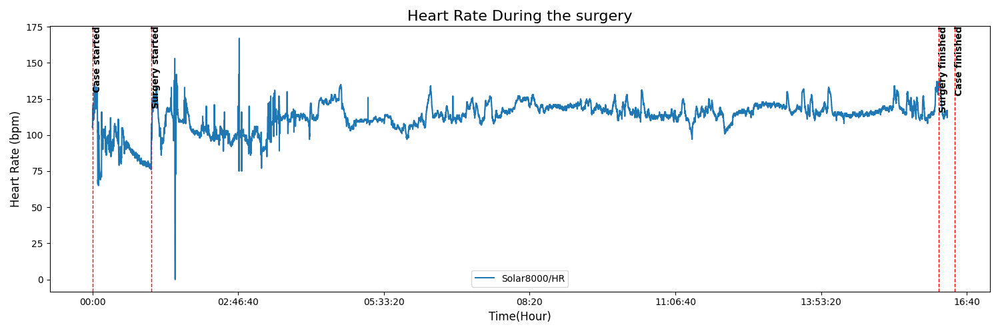
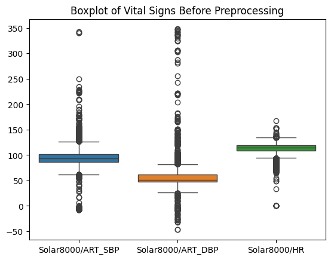
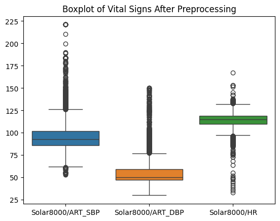
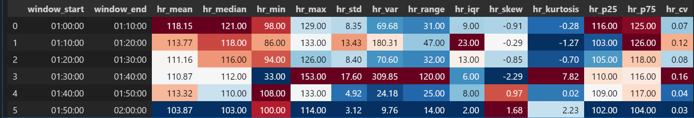
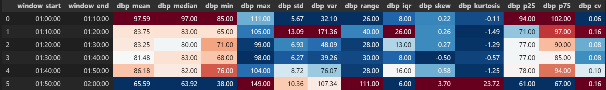
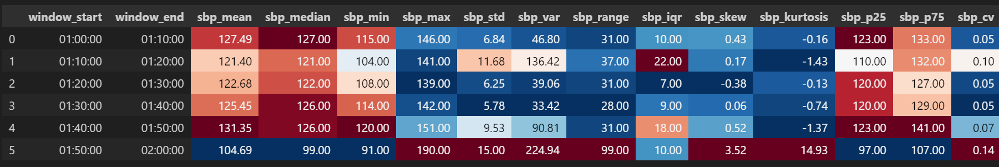
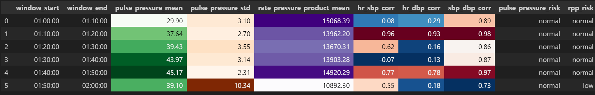
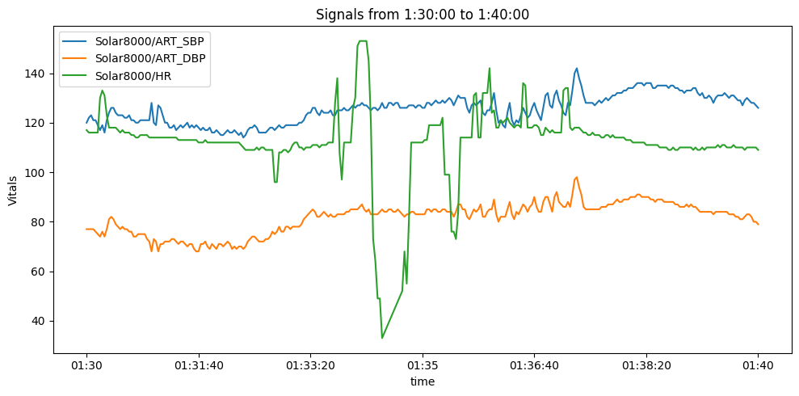

# Report: Data Analysis of Vital Signs in Surgical Patients
## Research Question: “How do heart rate and blood pressure interactions change over time during surgery?”

## Overview
This report summarizes the preprocessing, visualization, and initial findings derived from analyzing surgical patient data using the VitalDB dataset. The focus was on exploring key physiological signals—specifically, heart rate (HR) and blood pressure (systolic and diastolic)—sampled every two seconds during surgery.

- Selected vital tracks:
  - Solar8000/ART_SBP (Systolic Blood Pressure)
  - Solar8000/ART_DBP (Diastolic Blood Pressure)
  - Solar8000/HR (Heart Rate)

*This is the raw data distribution, There are also html versions available in the results directory for interactive exploration*

## Key Observations
- Duplicate rows: 19,260 (identical values, no duplicate timestamps).
- Missing values: 2,793 across various columns.
- Start and end of surgery contain NaNs due to device connection/disconnection.
- Decided to only analyze values withing the start - end surgery window, as these are the relevant data.

Below we can see tables containing information about consecutive gaps in the data.

**Systolic Gaps**
|   count | start_time      | end_time        | duration        |
|--------:|:----------------|:----------------|:----------------|
|     145 | 0 days 16:02:52 | 0 days 16:07:40 | 0 days 00:04:49 |
|      54 | 0 days 16:00:08 | 0 days 16:01:54 | 0 days 00:01:47 |
|      36 | 0 days 01:53:38 | 0 days 01:54:48 | 0 days 00:01:11 |
|      33 | 0 days 05:06:08 | 0 days 05:07:12 | 0 days 00:01:05 |
|      32 | 0 days 04:34:18 | 0 days 04:35:20 | 0 days 00:01:03 |
|      30 | 0 days 12:10:14 | 0 days 12:11:12 | 0 days 00:00:59 |
|      27 | 0 days 02:58:02 | 0 days 02:58:54 | 0 days 00:00:53 |
|      27 | 0 days 15:40:20 | 0 days 15:41:12 | 0 days 00:00:53 |
|      26 | 0 days 13:27:48 | 0 days 13:28:38 | 0 days 00:00:51 |
|      25 | 0 days 04:12:38 | 0 days 04:13:26 | 0 days 00:00:49 |
|      25 | 0 days 05:57:30 | 0 days 05:58:18 | 0 days 00:00:49 |
|      25 | 0 days 04:49:28 | 0 days 04:50:16 | 0 days 00:00:49 |
...

**Diastolic Gaps**
|   count | start_time      | end_time        | duration        |
|--------:|:----------------|:----------------|:----------------|
|     229 | 0 days 16:00:04 | 0 days 16:07:40 | 0 days 00:07:37 |
|      40 | 0 days 12:09:56 | 0 days 12:11:14 | 0 days 00:01:19 |
|      36 | 0 days 01:53:38 | 0 days 01:54:48 | 0 days 00:01:11 |
|      33 | 0 days 05:06:08 | 0 days 05:07:12 | 0 days 00:01:05 |
|      32 | 0 days 04:34:18 | 0 days 04:35:20 | 0 days 00:01:03 |
|      27 | 0 days 15:40:20 | 0 days 15:41:12 | 0 days 00:00:53 |
|      27 | 0 days 02:58:02 | 0 days 02:58:54 | 0 days 00:00:53 |
|      26 | 0 days 13:27:48 | 0 days 13:28:38 | 0 days 00:00:51 |
|      25 | 0 days 04:49:28 | 0 days 04:50:16 | 0 days 00:00:49 |
|      25 | 0 days 05:57:30 | 0 days 05:58:18 | 0 days 00:00:49 |
|      25 | 0 days 04:12:38 | 0 days 04:13:26 | 0 days 00:00:49 |
...

**Heart Rate Gaps**
|   count | start_time      | end_time        | duration        |
|--------:|:----------------|:----------------|:----------------|
|      10 | 0 days 02:16:42 | 0 days 02:17:00 | 0 days 00:00:19 |
|      10 | 0 days 07:16:50 | 0 days 07:17:08 | 0 days 00:00:19 |
|       9 | 0 days 12:17:00 | 0 days 12:17:16 | 0 days 00:00:17 |
|       8 | 0 days 01:34:26 | 0 days 01:34:40 | 0 days 00:00:15 |
|       1 | 0 days 06:17:54 | 0 days 06:17:54 | 0 days 00:00:01 |
|       1 | 0 days 07:56:24 | 0 days 07:56:24 | 0 days 00:00:01 |
|       1 | 0 days 07:56:34 | 0 days 07:56:34 | 0 days 00:00:01 |
|       1 | 0 days 07:56:30 | 0 days 07:56:30 | 0 days 00:00:01 |
|       1 | 0 days 07:56:48 | 0 days 07:56:48 | 0 days 00:00:01 |
...

## Data Cleaning Strategy
- Handled physiologically implausible values.
- Imputation strategies applied selectively based on gap size:
- Linear interpolation for gaps up to 20 seconds (≤10 samples)
- Chained forward-backward fill each for gaps up to 20 seconds (5 samples each)
- Exponentially Weighted Moving Average for the remaining nan values which were for the ~6-7 minute gap at the very end of the surgery

*Below we can see the difference of distribution in before and after preprocessing for all 3 signals*

We can see the implausible values are no longer there; however, we can still see outliers, as I decided to not exclude them since they may give important information about the patient's state.

## Analysis Visualizations
- Time series plots were generated to visually inspect signal trends and verify preprocessing effectiveness.
Below we can find some of them:  
**NOTE:** Color-coding is column-wise.

*Heart Rate Signal Features In The Specified TimeFrame*

*Diastolic BP Signal Features In The Specified TimeFrame*

*Systolic BP Signal Features In The Specified TimeFrame*

*This is the table showing the intersignal correlations and metrics such as Pulse Pressure and Rate Pressure Product*

*We can see the values in the cross signal table are reflected here, specially the low correlation, due to the sudden change in heart rate.*  
**NOTE:** We can use the smoothing option available in the `preprocess_vital_signs` function to make the trends more visible.

## Tools Used
- Python (Pandas, NumPy, SciPy)
- Jupyter Notebook for interactive analysis
- Custom modules:
  - `scripts.parser`
  - `scripts.visualization`
  - `scripts.analysis`

## Conclusion
The workflow demonstrated an effective, modular approach for signal preprocessing in clinical time series data. The insights will serve as a foundation for further analysis such as trend detection, anomaly detection, or clinical decision support.
